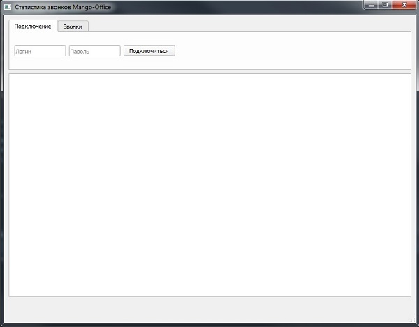
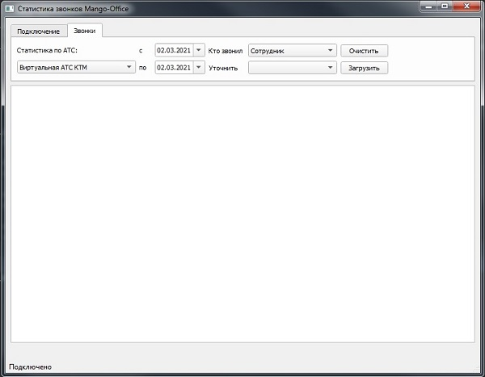
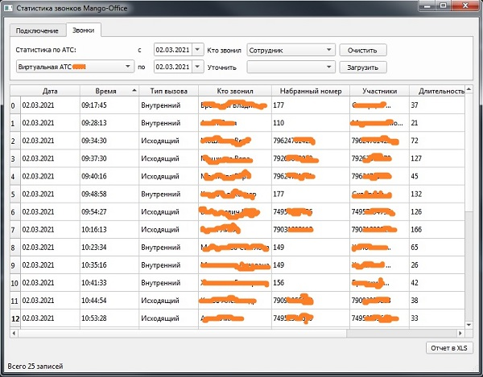
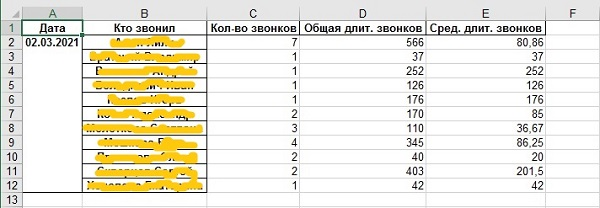

# MangoOffice Statistic

MangoOffice Statistic это приложение для просмотра истории звонков через облачную АТС в [Mango Office](https://mango-office.ru). 

Приложение написано на [Python](https://www.python.org) и имеет GUI интерфейс построенный при помощи библиотеки 
[Pyside2](https://pypi.org/project/PySide2/). Также в проекте используются библиотеки [Pandas](https://pandas.pydata.org)
 для работы с данными и [requests](https://pypi.org/project/requests/) для общения с сервисом 
 [Mango Office](https://mango-office.ru) через недокуменнтированное API.

# Возможности!

  - Возможность выбора АТС по которой будет запрашиваться история звонков
  - История входящих и/или исходящих звонков
  - Возможность уточнения кем были сделаны звонки
  - Выбор периода для истории звонков
  - Выгрузка сводной статистики по исходящим звонкам в xls
  
####Screenshots:

### Todos

 - Возможность запоминать последние учетные данные для авторизации на сервисе Mango Office
 - Визуализация данных отчета
 - Дополнительные отчеты 

License
----

[MIT license](https://opensource.org/licenses/MIT)